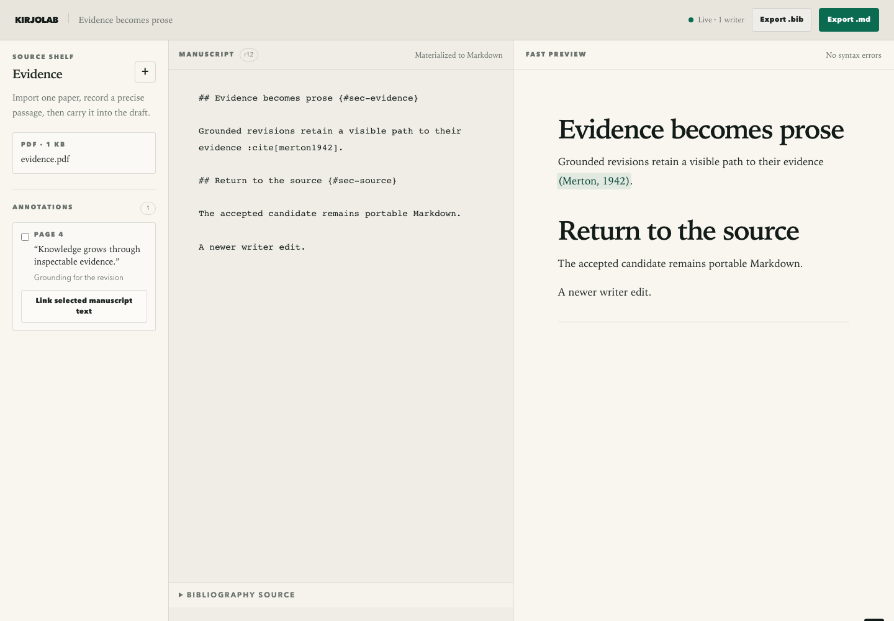

# Kirjolab

Kirjolab is a collaborative scholarly workspace that connects meaningful Markdown, publications, PDF annotations, and grounded local-model suggestions. The first vertical slice runs as a Cloudflare Worker with a Yjs-backed Durable Object and R2 PDF storage.

The current product surface intentionally proves one path: import evidence, annotate it, connect it to manuscript text, review a model-proposed revision, and export portable Markdown and BibTeX.

The repo vendors ASDLC reference material in `.asdlc/` as local guidance instead of recreating it per project. Repo-specific truth lives in `ARCHITECTURE.md`, `specs/`, and `docs/adrs/`: generated code still needs to match those documents, and passing CI alone is not enough.

Local development in this repo targets macOS. Other platforms may need script and tooling adjustments before the baseline workflow works as documented.

## Documentation

- Product and architectural direction: `VISION.md`
- Implemented scholarly-workspace contract: `specs/scholarly-workspace/spec.md`
- Implemented PDF evidence-capture contract: `specs/pdf-evidence-capture/spec.md`
- Implemented workspace catalog contract: `specs/workspace-catalog/spec.md`
- Implemented workspace access contract: `specs/workspace-access/spec.md`
- Implemented reference-library contract: `specs/reference-library/spec.md`
- Development setup and local CI: `docs/development.md`
- Architecture decisions: `docs/adrs/README.md`
- Feature and architecture specs: `specs/README.md`
- Agent behavior and project rules: `AGENTS.md`
- Partial-upgrade capability kits: `.capabilities/`
- Template maintenance update packs: `.template/updates/`

## Runtime

- Run `nvm use` before `npm install` or any other development command so your shell picks up the repo-pinned Node.js version from `.nvmrc` and stays close to the expected npm baseline.
- Install dependencies with `npm install`.
- `npm install` also configures the repo-managed `pre-push` hook so `git push` runs affected guardrails before code leaves your machine.
- The exact project Node.js version is pinned in `package.json` and mirrored in `.nvmrc` for `nvm` users, and CI reads the `package.json` value directly.
- npm is constrained to the supported npm 11 range in `package.json`; local development is expected to use `nvm use`, and CI uses the npm release bundled with the pinned Node setup as long as it satisfies that range.
- The current local slice needs no model key. Local model requests go directly from the browser to the configured OpenAI-compatible endpoint.
- Use repo-pinned CLI tools through `npx`, including `npx wrangler` for Cloudflare-based experiments.
- Start Kirjolab with `npm run dev`, then open `http://127.0.0.1:8787`.
- `npm run build` generates the Tailwind stylesheet, typed browser bundle, and version-matched PDF.js worker under the ignored `.generated/` directory.
- Local Wrangler automatically emulates the Durable Object and R2 bindings.
- Before a production deployment, create the configured bucket with `npx wrangler r2 bucket create kirjolab-papers`.
- Local `AUTH_MODE=local` is deliberately rejected away from loopback. For hosting, protect the application hostname with Cloudflare Access and configure `AUTH_MODE=access`, `ACCESS_TEAM_DOMAIN=https://<team>.cloudflareaccess.com`, and the application's `ACCESS_AUD` value through environment-specific Wrangler configuration or dashboard variables. Keep unprotected direct hostnames disabled.
- Set optional `CROSSREF_MAILTO=you@example.org` in deployment configuration to identify metadata enrichment requests to Crossref's polite pool. BibTeX import itself is local and needs no credentials.

## Verification

- Run the fast local gate with `npm run quality:gate:fast` during normal iteration.
- Run the baseline repo gate with `npm run quality:gate`.
- Run the containerized local workflow with `npm run ci:local`; it uses Agent CI parallelism with warm-cache serialization and pauses failed runners for retry.
- Run advisory codebase readability diagnostics with `npm run diagnostics:codebase`.
- The repo-managed `pre-push` hook runs `npm run quality:affected` automatically after `npm install`.
- If local Agent CI warns about `No such remote 'origin'`, set `GITHUB_REPO=owner/repo` in `.env.agent-ci`.
- Retry a paused local CI run with `npm run ci:local:retry -- --name <runner-name>`.
- Install the pinned Playwright browser with `npm run playwright:install`.
- Run unit tests from colocated `src/**/*.test.ts` files with `npm test`.
- Run browser tests from colocated `src/**/*.e2e.ts` files with `npm run e2e`.
- Run mutation tests against runtime `src/**/*.ts` files with `npm run mutation`.

## Capability Kits

Use `.capabilities/` when another project needs one template practice without adopting the whole starter. Each kit is a reviewable partial-upgrade guide with a README, manifest, package-manager recipe, copyable files, and validation checks.

To apply a kit to another repo:

1. Pick the smallest matching kit from `.capabilities/README.md`.
2. Read the kit README and `manifest.json`.
3. Follow the target package-manager recipe under `recipes/`.
4. Copy or merge files from `files/` without overwriting target-project conventions.
5. Ask before applying optional adjacent setup such as creating a GitHub Actions workflow.
6. Run the kit checks and the target repo's normal quality gate.

For existing projects where the right kit set is unclear, start with the negotiation prompt in `.capabilities/README.md`. It asks an agent to inspect the target repo, present a checkbox-style capability pull plan, and wait for approval before editing files.

## Template Update Packs

Use `.template/updates/` to sync later maintenance changes into projects that already use this template or one of its capability kits. Each update pack has metadata, a short migration guide, and a focused patch to try before porting the change manually.

For cross-repo agent work, tell the agent:

> Look at `vibe-template/.template/updates/AGENT_SYNC.md` for latest template updates.

## Current Vertical Slice

- Collaborative Markdown and BibTeX editing through Yjs WebSockets.
- Multiple isolated workspaces with stable URLs and identity-scoped navigation.
- Cloudflare Access JWT verification plus owner/member workspace sharing.
- Fast semantic preview and validation for the initial scientific-writing syntax.
- Streamed PDF import, selectable single-page rendering, resilient highlights, and bidirectional manuscript links.
- BibTeX library import with stable publication resources and explicit Crossref DOI enrichment.
- Browser-direct local-model requests with persisted candidate review/apply.
- Portable `.md` and `.bib` exports.

## Source Layout

- `src/worker.ts` is the Worker entry point and top-level router.
- `src/durable-objects/` holds document coordination and persistent metadata.
- `src/domain/` holds portable resource contracts and Markdown semantics.
- `src/api/` holds health and scholarly-workspace routes.
- `src/client/` holds the typed browser client and local-model operations.
- `src/views/` holds the server-rendered workspace shell.
- Tests live next to the code they exercise under `src/`.

## Application Screenshot

Refresh this asset manually when the starter UI changes materially.
